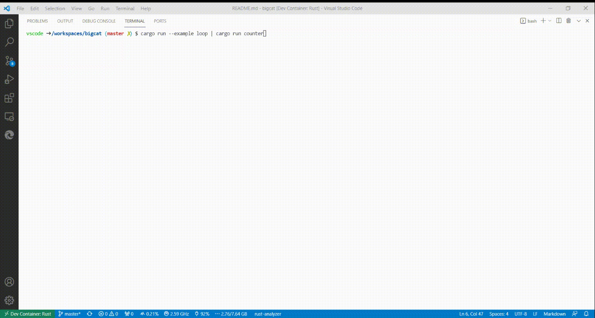

# bigcat
Simple command line utility which writes timestamp for each inputted line


## Example
`cargo run --example loop | cargo run counter`

or 
```shell
cargo run --example loop | bigcat  "program-1" >> out.log &
cargo run --example loop | bigcat  "program-2" >> out.log &
tail -f out.log
```

## Install
using run `cargo`
`cargo install bigcat`

OR

download from [here](https://github.com/cedric05/bigcat/actions/runs/1735112454)

## Demo
